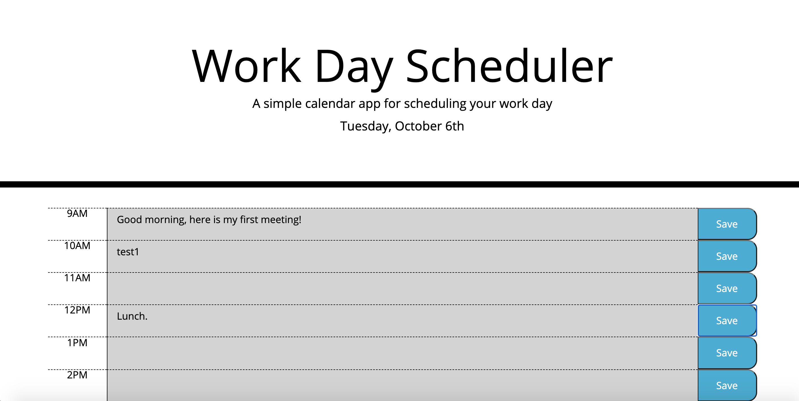

# my-work-day-scheduler

This is my work day scheduler that allows me to store events, by the hour, for a single day. Time blocks from 9AM - 5PM are dynamically created in 9 rows that will allow a write-up for each block to be stored in local cache when the respective save button is clicked. Text data for events persist upon web page reload/refresh. Additionally row coloring is applied to indicate gray for the past, red for the present, and green for the future.

URL of deployed app: https://204039643.github.io/my-work-day-scheduler/

- [Installation](#installation)
- [Usage](#usage)
- [Credits](#credits)
- [License](#license)

## Installation

Clone my Github repository to your local machine: https://github.com/204039643/my-work-day-scheduler

## Usage

1. Open webpage in browser: https://204039643.github.io/my-work-day-scheduler/
2. Select a time block of interest, 9AM - 5PM, and enter a text description of an event in the center text area for that block.
3. Click the respective save button for that time block.
4. Refresh the webpage and the event text should persist upon reload.
5. Repeat steps 2 - 5 to add more events to other time blocks.
Coloring: time blocks in the past will be colored gray, for present hour colored red, and future hours colored green.

## Credits

W3C Schools HTML JavaScript: https://www.w3schools.com/js/default.asp
MDN web docs JavaScript: https://developer.mozilla.org/en-US/docs/Web/JavaScript
Moment.js: https://momentjs.com/

## License

MIT License

Copyright (c) [2020] [Justin Sykes]

Permission is hereby granted, free of charge, to any person obtaining a copy
of this software and associated documentation files (the "Software"), to deal
in the Software without restriction, including without limitation the rights
to use, copy, modify, merge, publish, distribute, sublicense, and/or sell
copies of the Software, and to permit persons to whom the Software is
furnished to do so, subject to the following conditions:

The above copyright notice and this permission notice shall be included in all
copies or substantial portions of the Software.

THE SOFTWARE IS PROVIDED "AS IS", WITHOUT WARRANTY OF ANY KIND, EXPRESS OR
IMPLIED, INCLUDING BUT NOT LIMITED TO THE WARRANTIES OF MERCHANTABILITY,
FITNESS FOR A PARTICULAR PURPOSE AND NONINFRINGEMENT. IN NO EVENT SHALL THE
AUTHORS OR COPYRIGHT HOLDERS BE LIABLE FOR ANY CLAIM, DAMAGES OR OTHER
LIABILITY, WHETHER IN AN ACTION OF CONTRACT, TORT OR OTHERWISE, ARISING FROM,
OUT OF OR IN CONNECTION WITH THE SOFTWARE OR THE USE OR OTHER DEALINGS IN THE
SOFTWARE.
